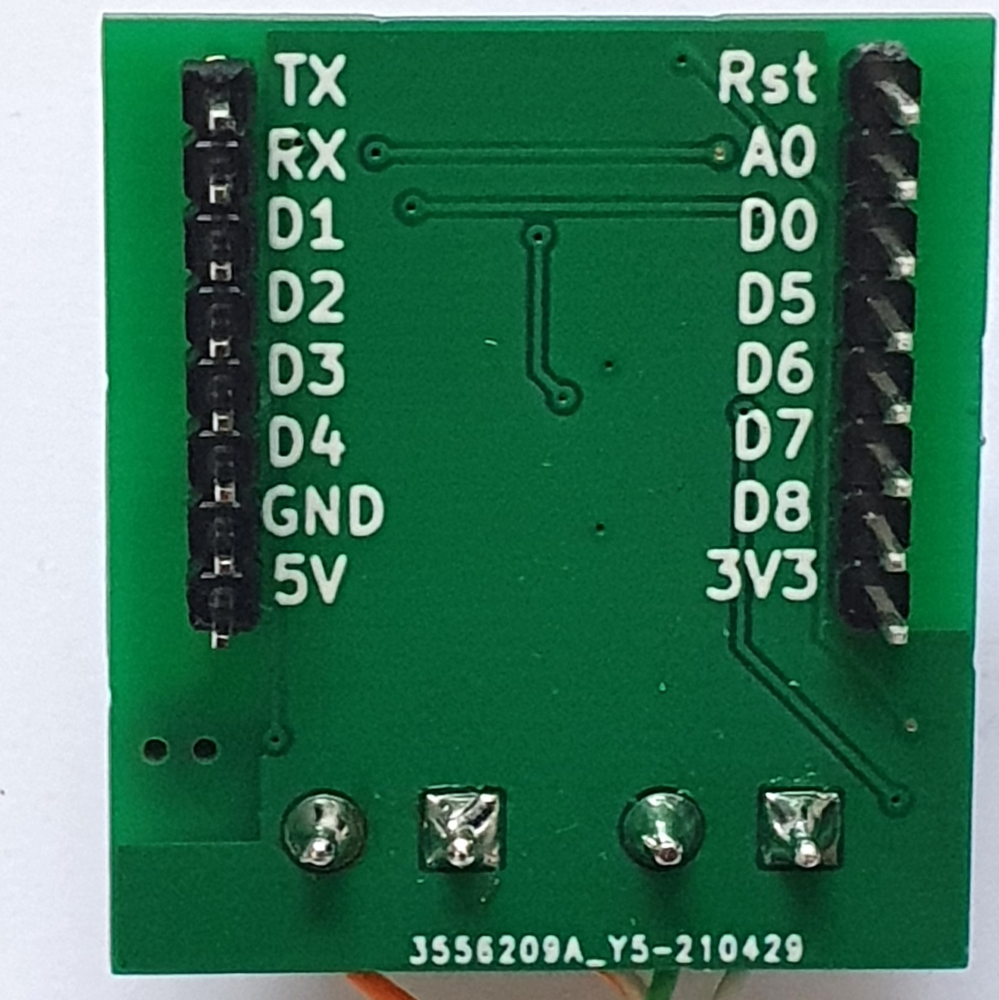

# Twomes OpenTherm Monitor Shield

This repository contains the open hardware design files for the Twomes OpenTherm Monitor device, which can be used as a [WeMos D1 Mini shield](https://www.wemos.cc/en/latest/d1_mini_shield/index.html). The device is connected via one wire pair to a [boiler that supports OpenTherm](https://www.otgw.tclcode.com/matrix.cgi#boilers) and via another wire pair to a (thermostat that supports OpenTherm)[https://www.otgw.tclcode.com/matrix.cgi#thermostats]. 

This is device  is NOT a gateway; it only monitors OpenTherm traffic and cannot be used to insert OpenTherm commands to the boiler or thermostat.

 

## Table of contents
* [General info](#general-info)
* [Prerequisites](#prerequisites)
* [Producing](#producing)
* [Developing](#developing) 
* [Features](#features)
* [Status](#status)
* [License](#license)
* [Credits](#credits)

## General info
This repository will soon contain the open hardware design files, such as schematics and board layout files for the Twomes OpenTherm Monitor device.

The associated firmwware that you can run on this device, please see another repository. Initially, the firmware will be developed as a branch for the [Twomes OpenTherm DIYLESS gateway](https://github.com/energietransitie/twomes-opentherm-gateway-diyless) firmware, until it is ripe for its own repository.

## Prerequisites
Describe which hardware and software you need to produce and/or develop the hardawre. If the prerequisites are different for users that only wish to produce hardware versus uers that (also) wish to develop new versions of the hardware, you may want to move the prerequisites section as a subsection of each of those sections.

## Producing

Describe how the reader use the files contained in this repository to produce the PCB hardware and enclusure(s). 

### Printed Ciruit Board
Document how to order (small) series of PCBs from a PCB fabrication service, including SMT assembly if the design calls for it. Use steps if the procedure is non-trivial:
1. first step;
2. second step;
3. final step.

Format any scripts or commands in a way that makes them  easy to copy, like the following example. 

Forgotten your Wi-Fi password? No problem with the follwing command, replacing `SSID` with the Wi-Fi name of your own Wi-Fi network: 
```shell
netsh wlan show profile SSID key=clear
```
### Enclosure
Document how to print (small) series of enclosures, e.g. on a 3D printer, and/or how to order enclusures, e.g. from a 3D printing service. Use steps if the procedure is non-trivial:
1. first step;
2. second step;
3. final step.

Format any scripts or commands in a way that makes them  easy to copy, like the following example. 

Forgotten your Wi-Fi password? No problem with the follwing command, replacing `SSID` with the Wi-Fi name of your own Wi-Fi network: 
```shell
netsh wlan show profile SSID key=clear
```

## Developing
Describe how the reader can change or extend the harware design. 

## Features
List of features ready and TODOs for future development. Ready:

* awesome feature 1;
* awesome feature 2;
* awesome feature 3.

To-do:

* wow improvement to be done 1;
* wow improvement to be done 2.

## Status
Project is: _in progress_

## License
The hardware in this repository is available under the [CERN-OHL-P v2 license](./LICENSE.md), Copyright 2021 [Research group Energy Transition, Windesheim University of Applied Sciences](https://windesheim.nl/energietransitie)

`---or ---`

The hardware in this repository is available under the [CERN-OHL-W v2 license](./LICENSE.md), Copyright 2021 [Research group Energy Transition, Windesheim University of Applied Sciences](https://windesheim.nl/energietransitie)

`N.B. Whether we apply the P(ermissive) or W(ealy raciprocal) variant of the CERN-OWH v2 licence for the hardware designs has not been determined yet. DO NOT make this repo public before we've decided the exact license.` 

## Credits
This open hardware design is a collaborative effort of:
* <contributor name 1> ·  [@Github_handle_1](https://github.com/<github_handle_1>) ·  Twitter [@Twitter_handle_1](https://twitter.com/<twitter_handle_1>)
* <contributor name 2> ·  [@Github_handle_2](https://github.com/<github_handle_2>) ·  Twitter [@Twitter_handle_2](https://twitter.com/<twitter_handle_2>)
* <contributor name 3> ·  [@Github_handle_3](https://github.com/<github_handle_3>) ·  Twitter [@Twitter_handle_3](https://twitter.com/<twitter_handle_3>)
* etc. 


We use and gratefully aknowlegde the efforts of the makers of the following designs:

* [library name 1 and version](library 1 URL), by <copyright holder name 1>, licensed under [license 1 name](license1 URL)
* [library name 2 and version](library 2 URL), by <copyright holder name 2>, licensed under [license 2 name](license2 URL)
* [library name 3 and version](library 3 URL), by <copyright holder name 3>, licensed under [license 3 name](license3 URL)
* etc. 
