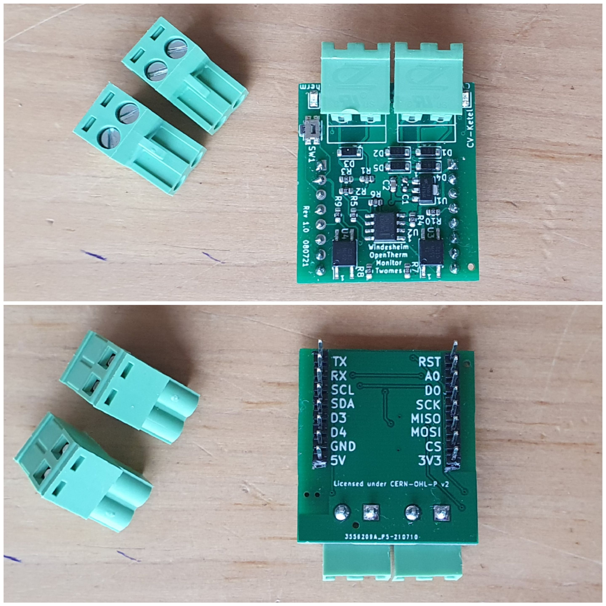
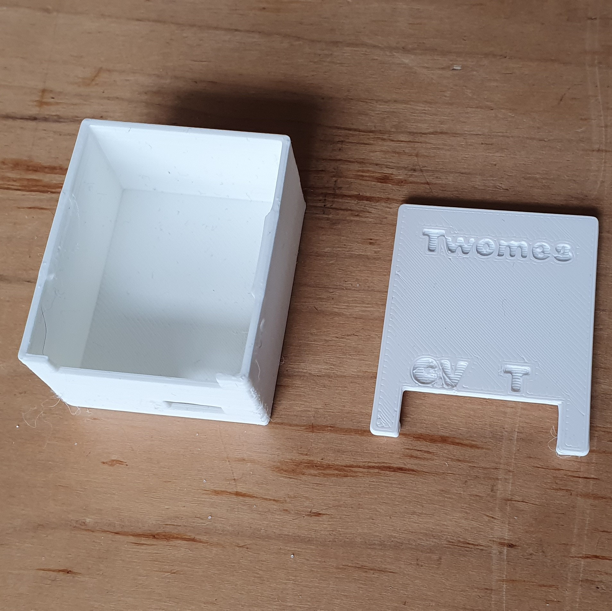

# Twomes OpenTherm Monitor Shield hardware

This repository contains the open hardware design files for the Twomes OpenTherm Monitor device.

For the associated e firmware and pointers to binary releases for the Twomes OpenTherm Monitor, please see the [twomes-opentherm-monitor-firmware](https://github.com/energietransitie/twomes-opentherm-monitor-firmware) repository.

## Table of contents
* [General info](#general-info)
* [Producing](#producing)
* [Developing](#developing) 
* [Features](#features)
* [Status](#status)
* [License](#license)
* [Credits](#credits)

## General info
This repository will soon contain the hardware designs, such as [schematics](./pcb/Output\schematicv11.png) and board layout files for the Twomes OpenTherm Monitor Shield:  a [WeMos D1 Mini shield](https://www.wemos.cc/en/latest/d1_mini_shield/index.html), to be placed on top of a WeMos D1 Mini board, such as the [LilyGO TTGO T7 Mini32 V1.3 ESP32](https://github.com/LilyGO/ESP32-MINI-32-V1.3), which is based on an ESP32 SoC, or the [Wemos LOLIN D1 mini](https://www.wemos.cc/en/latest/d1/d1_mini.html), which is based on an ESP8266 SoC. 

The OpenTherm Monitor Shield is connected via one wire pair to a [boiler that supports OpenTherm](https://www.otgw.tclcode.com/matrix.cgi#boilers) and via another wire pair to a [thermostat that supports OpenTherm](https://www.otgw.tclcode.com/matrix.cgi#thermostats). 

This is device  is NOT an OpenTherm gateway; it only monitors OpenTherm traffic and it cannot insert OpenTherm commands to the boiler or thermostat.

The associated firmware that you can run on this device can be found in [this repository](https://github.com/energietransitie/twomes-opentherm-monitor-firmware).

## Producing

### Printed Ciruit Board
To manufacture the printed circuit board you can use various PCB services. 

To have the PCBs manufactured via [JLCPCB](https://www.jlcpcb.com), the PCB manufacturer we used, you can re-use the files in the folder [Output](./pcb/Output/FABRICATION). Upload the Gerber files in a zip to their [quote page](https://cart.jlcpcb.com/quote), select the amount of PCBs and a colour for silkscreen. All other options can be left on default. If SMT assembly is desired, also select this option before ordering. This will take you to a page where the BOM and POS file can be uploaded. Use the files [OpenThermMonitorTwomesBOM.csv](./pcb/OpenThermMonitorTwomesBOM.csv) and and [OpenThermMonitorTwomes-top-pos.csv](./pcb/plots/OpenThermMonitorTwomes-top-pos.csv).
### Enclosure
The folder [enclosure](./enclosure) contains both Fusion360 source files and exported STL files for the Twomes P1 Gateway enclosure. The STL files can be imported into any slicer and turned into G-Code for a 3D printer. You can also upload  the STL files to an online 3D printing service of your choice.

## Developing
To change the hardware designs, you need:
* [KiCad](https://www.kicad.org/download/) installed to change te PCB design. 

Some EDA tools may be able to convert the files, however this is not supported and may result in errors.

To export the modified PCBs, consult the webpage of your PCB manufacturer of choice for guidance on how to produce the output files. For example,  see the [JLCPCB guide on how to export Gerbers](https://support.jlcpcb.com/article/149-how-to-generate-gerber-and-drill-files-in-kicad) and the  [JLCPCB guide how to export the BOM and POS files](https://support.jlcpcb.com/article/84-how-to-generate-the-bom-and-centroid-file-from-kicad)

## Features
List of features ready and TODOs for future development. Ready:

* awesome feature 1;
* awesome feature 2;
* awesome feature 3.

To-do:

* wow improvement to be done 1;
* wow improvement to be done 2.

## Status
Project is: _in progress_

## License
The hardware designs in this repository are available under the [CERN-OHL-P v2 license](./LICENSE), Copyright 2021 [Research group Energy Transition, Windesheim University of Applied Sciences](https://windesheim.nl/energietransitie)

## Credits
This open hardware design was made by:
* Marco Winkelman · [@MarcoW71](https://github.com/MarcoW71)

We use and gratefully acknowlegde the efforts of the makers of the following designs:

* [KiCad Libraries](https://kicad.github.io/), by the KiCad Development Team, licensed under [adapted version of the CC-BY-SA 4.0 License](https://www.kicad.org/libraries/license/)
* [Opentherm-monitor](https://www.domoticaforum.eu/uploaded/bwired/Open-Termostaat.pdf). In <i>Elektuur, 7-8/2001, pp. 22-23.
